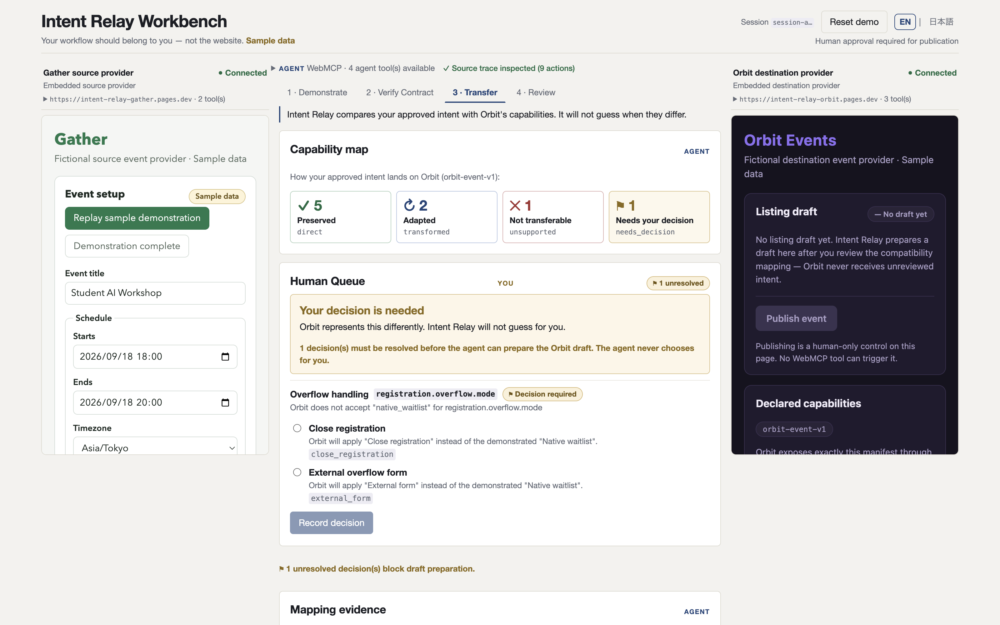
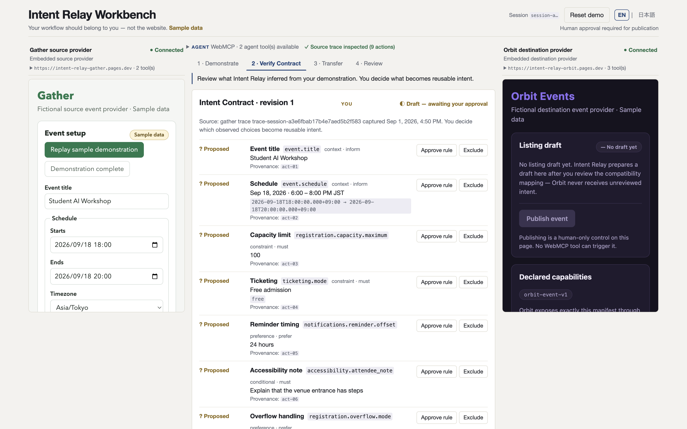
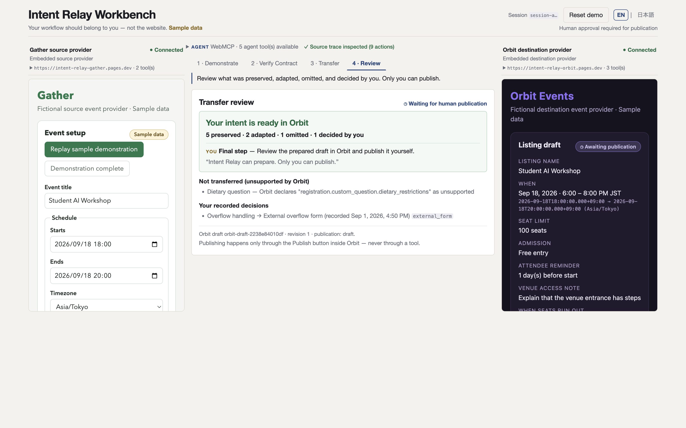

# Intent Relay

**Teach the web how you work once. Carry it everywhere.**

Intent Relay does not replay clicks. It turns one human demonstration into a
reviewed, provenance-backed **Intent Contract** — then translates that intent
onto a structurally different website through the capabilities each site
exposes over **WebMCP**. When two sites represent the same idea differently,
the agent does not guess: the mismatch comes back to you as a decision.

**[Try the live Workbench →](https://intent-relay-workbench.pages.dev/workbench)** · [How it works](#how-it-works) · [WebMCP tool contracts](docs/WEBMCP_TOOL_CONTRACTS.md)

Three cross-origin production sites · real `document.modelContext` tool
discovery and execution · verified in stock Chrome 152 with **no feature
flags** (first-party Origin Trial on the production origins).



Most WebMCP examples explore what an agent can do on one website. Intent
Relay explores a different question: **what happens to human intent when it
has to cross websites?**

## Click replay is the wrong abstraction

You set up an event on one site: capacity 100, free admission, a waitlist
when it fills, a reminder 24 hours before, and a rule that nothing goes
public without your review.

Now express the same thing on another site. The fields have different names.
The reminder is measured in days, not hours. There is no waitlist — the
closest thing is an external overflow form. And "publish" means something you
might not want an automation to touch.

Recorders and RPA preserve the _actions_: coordinates, selectors, field
values. None of that survives contact with a differently-built site — and
none of it remembers _why_ you chose what you chose, which choices were hard
constraints, or where your approval is required.

Intent Relay keeps the intent and drops the clicks. WebMCP is what makes that
possible: each site exposes its actual capabilities as typed tools, so intent
can be checked against what the destination can really do — instead of being
force-fed through its UI. WebMCP does not make websites identical, and Intent
Relay does not pretend it does. Handling the mismatch _is_ the product.

## What a transfer actually looks like

One approved contract, nine rules, checked against Orbit's declared
capabilities — every rule receives exactly one explicit status:

|       | Status              | What it means                                                                                 | In the demo                                                                                                         |
| ----- | ------------------- | --------------------------------------------------------------------------------------------- | ------------------------------------------------------------------------------------------------------------------- |
| **5** | Preserved           | Orbit represents the intent the same way                                                      | title, schedule, capacity, free admission, your publication-approval rule                                           |
| **2** | Adapted             | same intent, different shape — converted deterministically, with the conversion shown         | 24 hours → 1 day (Orbit schedules reminders in whole days); attendee accessibility note → Orbit's venue access note |
| **1** | Not transferable    | Orbit has no equivalent — excluded _and shown_, never silently dropped                        | the dietary-restrictions question                                                                                   |
| **1** | Needs your decision | Orbit represents the concept differently, and no answer can be derived from the demonstration | Gather's native waitlist: Orbit offers _close registration_ or _an external overflow form_                          |

**"Needs your decision" is deliberate behavior, not an error.** The
demonstration says a waitlist was wanted. It cannot say which substitute is
acceptable on a site that has none. An agent that picks one anyway is
inventing user intent. Intent Relay stops, explains the gap, and the **Human
Queue** records the human's choice — which then becomes part of the
transfer's audit trail.

## How it works

```text
        Gather ──────────────  Intent Relay Workbench  ────────────── Orbit
   (source site)                (human + agent desk)          (destination site)
        │                              │                              │
        │  WebMCP: read_event_state    │   WebMCP: describe_event_capabilities
        │  read_setup_trace            │   prepare_event_draft · read_event_draft
        └──────────────▶───────────────┼──────────────▶───────────────┘

  human demonstrates ▶ semantic trace ▶ Intent Contract draft (provenance-backed)
                     ▶ human reviews every rule ▶ approved contract
                     ▶ capability mapping — 5 preserved · 2 adapted · 1 not transferable
                     ▶ 1 decision returned to the human (Human Queue)
                     ▶ prepared Orbit draft ▶ human publishes (never a tool)
```

Gather records what changed and what it meant — semantic actions, never
coordinates or CSS selectors. From that trace the agent proposes an Intent
Contract **draft** in which every rule cites the recorded actions that
justify it. One demonstration cannot reliably distinguish a durable
preference from an incidental value, so nothing is declared permanent intent:
the human approves or excludes each rule, then approves the contract. Only
then is the approved intent mapped onto the destination's declared
capabilities, and only after every semantic gap has a human decision does the
agent prepare Orbit's draft. Preparation is pinned to a content hash of the
mapping that was reviewed — if anything shifts underneath, the transfer fails
closed instead of proceeding on stale intent.



## Built on WebMCP — not around it

WebMCP is an experimental browser capability (currently a Chrome origin
trial) that lets a page register typed tools for agents, and lets a page
discover and execute tools that _other_ pages expose to it.

Intent Relay uses it as the only integration surface between three real
cross-origin sites:

- the Workbench embeds Gather and Orbit as cross-origin iframes with
  `allow="tools"`;
- each provider registers its tools with `exposedTo: [RELAY_ORIGIN]` — an
  exact origin, never a wildcard;
- the Workbench discovers them via
  `document.modelContext.getTools({ fromOrigins: [...] })` and executes the
  browser-provided tool objects directly.

| Site                     | WebMCP tools                                                                                                                                                                   |
| ------------------------ | ------------------------------------------------------------------------------------------------------------------------------------------------------------------------------ |
| Gather (source)          | `read_event_state` · `read_setup_trace`                                                                                                                                        |
| Orbit (destination)      | `describe_event_capabilities` · `prepare_event_draft` · `read_event_draft`                                                                                                     |
| Workbench (agent-facing) | `inspect_source_demonstration` · `save_intent_contract_draft` · `inspect_target_compatibility` · `prepare_target_draft` · `get_transfer_review` — registered state-dependently |

**There is no publish WebMCP tool.** Publication is a button inside Orbit,
and deliberately not a tool on any origin.

Why not DOM scraping or click automation? Scraping recovers pixels and
markup, not semantics: it cannot tell a hard constraint from an incidental
default, and its contract with the target site is the DOM structure — the
very thing that differs between sites and breaks first. Here the
interoperability contract is each site's declared capability schema. Gather
and Orbit remain deliberately different, and that is exactly why a
compatibility layer — and a human — sit in the middle.

## Who can do what

This boundary is enforced in the domain layer, not just the UI.

**Only the human can:** approve or exclude each contract rule · approve the
contract · resolve a semantic gap in the Human Queue · revise an approved
contract · publish in Orbit.

**The agent can:** inspect the demonstration · propose a provenance-backed
contract draft · map approved intent onto Orbit's capabilities · prepare the
Orbit draft · report exactly what was preserved, adapted, excluded, and
decided by the human.

**The agent can prepare. Only the human can publish.**



## Production verification

The deployed system — three HTTPS Cloudflare Pages origins, each carrying a
first-party WebMCP Origin Trial token — was verified end-to-end in stock
Chrome 152 with no `WebMCPTesting` or experimental feature flags: real
cross-origin tool discovery and execution, the canonical
5 / 2 / 1 / 1 mapping, Human Queue resolution, draft preparation ending in
`waiting_for_human`, no publish or activate tool on any origin, and zero
console or page errors. The same checks are recorded in
[docs/REAL_WEBMCP_CHECKLIST.md](docs/REAL_WEBMCP_CHECKLIST.md), which also
documents where real Chrome's WebMCP behavior diverges from test doubles.

## Try it

**Live** — <https://intent-relay-workbench.pages.dev/workbench>
Requires a WebMCP-capable Chrome; the production origins carry first-party
Origin Trial tokens, so current Chrome needs no flags. If the API is absent,
the Workbench says so explicitly instead of simulating results. The Workbench
ships in English and Japanese (EN | 日本語 toggle). All data is labeled
sample data.

**Local**

```sh
npm ci
npm run dev        # Relay :4173 · Gather :4174 · Orbit :4175
```

Open `http://localhost:4173/workbench`. Local WebMCP needs a Chrome started
with `--enable-features=WebMCPTesting --enable-experimental-web-platform-features`
(localhost is not covered by the origin trial). Everything a human reviews
stays visible without it.

**Verify**

```sh
npm run format:check && npm run lint && npm run typecheck && npm run test
npm run build
npx playwright install chromium   # one-time browser download for the E2E suite
npm run test:e2e   # Playwright over the real orchestrator (deterministic test adapter)
```

## Limitations and design stances

- **One demonstration is evidence, not proof.** A single walkthrough cannot
  establish that every observed value is a durable preference — so the agent
  proposes a _draft_ contract with per-rule provenance, and nothing becomes
  reusable intent until the human approves it. That is a stance, not a gap.
- **The proof domain is event setup.** Gather and Orbit are prototype
  WebMCP-enabled providers built for this project, and the mapping vocabulary
  (schedules, capacity, waitlists, reminders…) is scoped to that domain. The
  contract and mapping machinery is domain-generic; the vocabulary is not,
  yet.
- **WebMCP is experimental.** The live demo runs in current Chrome through a
  first-party origin trial; other browsers and future spec changes are real
  unknowns. Locally it sits behind Chrome feature flags.
- **Unresolved semantic mismatches stop the pipeline — on purpose.** An agent
  that always completes would have to invent intent to do so.
- **The demo data is labeled sample data throughout**; nothing here handles
  real customer data.

## Repository

```text
apps/relay     Workbench (human + agent desk, agent-facing WebMCP tools)
apps/gather    source provider (semantic demonstration + 2 WebMCP tools)
apps/orbit     destination provider (capability manifest + 3 WebMCP tools)
packages/      contract validation · provider protocol · deterministic
               mapping engine · WebMCP adapter · UI primitives · fixtures
e2e/           Playwright suite over the real orchestrator
```

Deeper documentation:
[Product specification](docs/PRODUCT_SPEC.md) ·
[WebMCP tool contracts](docs/WEBMCP_TOOL_CONTRACTS.md) ·
[Acceptance tests](docs/ACCEPTANCE_TESTS.md) ·
[Deployment](docs/DEPLOYMENT.md) ·
[Security headers](docs/SECURITY.md) ·
[Real-WebMCP verification](docs/REAL_WEBMCP_CHECKLIST.md) ·
[Demo script](docs/DEMO_SCRIPT.md)

## License

MIT — see [LICENSE](LICENSE).
